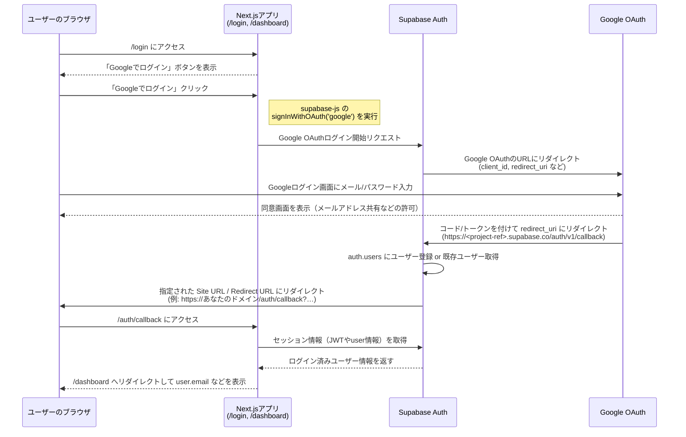
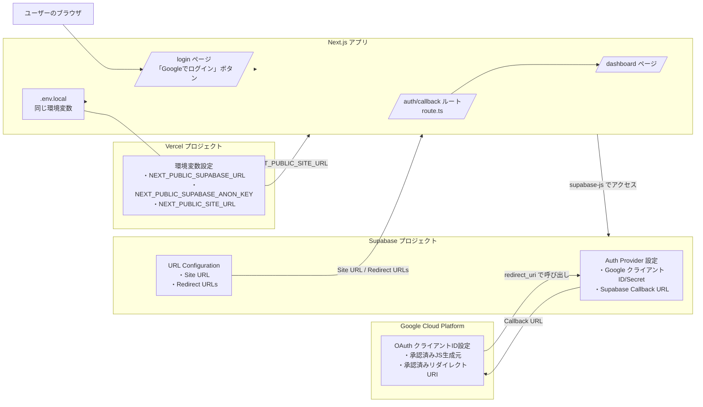

# 「Googleアカウントによるログイン」を自作アプリに実装する

## 背景

個人開発しているWebアプリにログイン機能を付ける必要がありました。

しかし、アプリを使うためにメールアドレスと新しいパスワードを用意してもらうのは負荷だと思ったため、「**Googleアカウントでログイン**」できる機能を実装しようと思い立ち、本記事を作成しました。

## やったこと

- Webアプリに「Googleアカウントでログイン」機能を実装する

    具体的には…

  1. ログイン画面（`/login`）と、ログイン後のホーム画面（`/dashboard`）を作成する
  2. ログイン画面に「Googleアカウントでログイン」ボタンを作成する
  3. 「Googleアカウントでログイン」ボタンを押すと、ログインに使うGoogleアカウントを選択・許可する画面に遷移して、ホーム画面に入れるようにする

### OAuthログインの全体フロー図

**ポイント**

- 「Next.jsが直接Googleとやり取りしているわけではない」

    → 常に Supabase Auth が中継役になっている（Googleとトークンをやり取りしてくれるのはSupabase）
- Google → Supabase → Next.js の順番で戻ってくる

  - Googleのredirect先：https://<project-ref>.supabase.co/auth/v1/callback
  - そこからさらに、Supabaseがあなたのアプリ（Site URL or Redirect URL）へリダイレクト



### 設定項目の関係図



## 使用技術スタック

- フロントエンド: Next.js
- デプロイ: Vercel
- Supabase Auth
- Google OAuth

※ 全て無料

## 手順

### 前提: 作業に取り組んだ環境

- Windows 11 のPC
- WSL2上（ディストリビューションはUbuntu-24.04）にて実施

### 1. Supabaseプロジェクトを作成

#### 目的

アプリが利用する「バックエンド（DB＋認証API）」を作るための準備。
SupabaseはFirebaseのように、DB・Auth・Storage・APIを全部まとめて提供してくれる。

#### 手順詳細

1. <https://supabase.com> でサインアップ/ログイン
2. New project を作成

    - Organization: 既存 or 新規（今回は既に作成済のものを使用）
    - Project name: 任意（今回は`Google-OAuth-test`）
    - Database Password: 任意の強いパスワード
    - Region: 近いリージョン（今回はRecommendにあった`Asian Pacific`を選択）
    - Free（Free Tier）でOK

3. 作成後、左メニュー Project Settings を選択し、

    - Project URL（例: <https://xxxxx.supabase.co）>（左メニュー Data API の中にある）
    - anon key（public anon key）（左メニュー API Keys の中にある）

    を控える

    → これらは後で Next.js の`.env.local`に入れます。

#### 理解ポイント

- Project URL → Supabase APIのエンドポイント。
- anon key → 認証が不要な「公開アクセスキー」。ブラウザからも使える。
- サーバー側だけで使う場合はservice_role keyという別の秘密鍵を使う。

#### 補足

Supabaseは内部的にPostgreSQLを持っており、Auth機能もこのDB上のauthスキーマに格納されます。

### 2. Google OAuthを有効化

#### 目的

Googleが提供する「本人確認サービス（OAuth 2.0）」を使って、Googleログインを許可する設定。

#### 手順詳細

1. Google Cloudのコンソール <https://console.cloud.google.com/> にアクセス → 新規プロジェクトを作成（今回は`Google-OAuth-test`）
2. 左メニュー API とサービス → OAuth 同意画面
3. プロジェクトを作成したばかりでまだ何も作られていない場合は、

    >「Google Auth Platform はまだ構成されていません
    アプリケーションの ID を構成すること、および Google API の呼び出しと Google でログインのための認証情報を管理することを開始します。」

    と真ん中に表示されている。**開始**ボタンを押す
4. 以下のように設定

    - 1.アプリ情報 > アプリ名: Google-OAuth-test
    - 1.アプリ情報 > ユーザーサポートメール: 自分のEmailアドレス
    - 2.対象: 外部
    - 3.連絡先情報: 自分のEmailアドレス
    - 4.終了: 同意にチェック

    → **作成**ボタンが現われるので、押す
5. 画面遷移後、画面中央の**OAuthクライアントを作成**もしくは左メニューのクライアント > **クライアントを作成**を押す
6. 「OAuthクライアントIDの作成」と書かれた画面が出てくる。以下のように設定

    - アプリケーションの種類: ウェブアプリケーション
    - 名前: 任意（おすすめは、`<アプリ名> - <環境> - OAuth Client` / 今回は`Google-OAuth-test - Local - OAuth Client`とした）
    - 承認済みのリダイレクト URI: 承認済みのリダイレクトURI に Supabase のコールバックURL を登録（例: <https://your-project-ref.supabase.co/auth/v1/callback>）

        ※ 補足: `your-project-ref`は SupabaseのSettingsに表示されたプロジェクトID（SupabaseダッシュボードURL末尾にも表示されている

    → **作成**ボタンを押す

7. 「OAuthクライアントを作成しました」と出てくるので、

    - クライアントID
    - クライアントシークレット

    を控えておく

#### 理解ポイント

- OAuth = 外部サービスでの本人認証を安全に行う仕組み。
- 「同意画面」で、アプリがユーザーのGoogleアカウント情報（emailなど）にアクセスすることをGoogleに申請。
- クライアントID/シークレット = アプリを識別するGoogle側の発行キー。

#### 補足

OAuthでは「アプリ→Google→ユーザー→Google→アプリ」みたいにトークンが返ってくる流れになっています。

### 3. Supabase ダッシュボードで Google Provider 設定

#### 目的

Supabase側に「Google OAuthでログインを受け付けるよ」と教える設定。

#### 手順詳細

1. Supabase ダッシュボード → 左メニュー Authentication → 左メニュー Sign In / Providers → Supabase Auth タブ → Auth Providersで「Google」を選択
2. 以下のように設定

    - Enable Sign in with Google: ON
    - Client IDs: 前項で入手したクライアントID
    - Client Secret: 前項で入手したクライアントシークレット
    - Skip nonce checks: OFF
    - Allow users without an email: ON
    - Callback URL: Supabase のコールバックURL を登録（例: <https://your-project-ref.supabase.co/auth/v1/callback>）

        ※ 補足: `your-project-ref`は SupabaseのSettingsに表示されたプロジェクトID（SupabaseダッシュボードURL末尾にも表示されている

    → **save**ボタンを押す
3. Supabase ダッシュボード → 左メニュー Authentication → 左メニュー URL Configurationを選択して以下のように設定

    - Site URL: <http://localhost:3000>
    - Redirect URLs: <http://localhost:3000/auth/callback>

#### 理解ポイント

- Googleで認証されたあと、Supabaseが「その人の情報を元にログインセッションを発行」してくれます。
- コールバックURL（.../auth/v1/callback）は、Google → Supabaseへの戻り先。
- Site URLとRedirect URLsは、Supabase → あなたのアプリへの戻り先。

#### 補足

このステップでSupabaseがOAuthの中継役になります（Googleからユーザー情報を受け取って、自身のJWTを発行する）。

### 4. Next.js 14（TypeScript）プロジェクトを作成

#### 目的

フロントエンド（UIとルーティング）を作る環境構築。

#### 手順詳細

1. WSL上にプロジェクトフォルダを作成

    ```bash
    mkdir ~/projects/webapp-study_google-oauth
    ```

2. プロジェクトフォルダに移動して、Next.jsプロジェクトを新規作成する。

    ★ **Next.js公式のテンプレート生成ツール「create-next-app」** を使用すればコマンド1つで作成できる。

    ```bash
    cd ~/projects/webapp-study_google-oauth
    npx create-next-app@latest . --ts
    ```

    いくつか確認が出てくるので、以下のように設定

    ```bash
    Need to install the following packages: create-next-app@16.0.1 Ok to proceed? (y) → yを入力してEnterを押す
    ✔ Which linter would you like to use? › ESLint
    ✔ Would you like to use React Compiler? … Yes
    ✔ Would you like to use Tailwind CSS? … Yes
    ✔ Would you like your code inside a `src/` directory? … Yes
    ✔ Would you like to use App Router? (recommended) … Yes
    ✔ Would you like to use Turbopack? (recommended) … No
    ✔ Would you like to customize the import alias (`@/*` by default)? … No
    ```

    → 作成されるので、待つ

    ※補足 コマンドの意味

    | 部分                         | 意味                                       |
    | -------------------------- | ---------------------------------------- |
    | **npx**                    | npmパッケージを一時的に実行するコマンド。（インストールせずに使える） |
    | **create-next-app@latest** | Next.js公式のテンプレート生成ツール（最新バージョンを指定）        |
    | **webapp-study_google-oauth**  | 作成するフォルダ（プロジェクト）名                        |
    | **--ts**                   | TypeScriptテンプレートを使うオプション（`.tsx` 形式）      |

    ※ npm的にはプロジェクトフォルダ = npmパッケージ として扱われる（`package.json`の`"name"`がnpmにとってパッケージ名にあたる）ため、フォルダ名は以下のルールを満たしている必要がある。

    - 小文字（a–z）
    - 数字（0–9）
    - ハイフン（-）とアンダースコア（_）はOK
    - 大文字（A–Z）は禁止

3. 依存パッケージを追加する

    - Supabase JS SDK
    - SSRヘルパ

    ```bash
    npm i @supabase/supabase-js @supabase/ssr
    ```

    ※プロジェクトフォルダにのみインストールされる。

### 5. 環境変数を設定（`.env.local`）

プロジェクト直下に`.env.local`を作成して以下を追加:

```dotenv
NEXT_PUBLIC_SUPABASE_URL=https://<your-project-ref>.supabase.co
NEXT_PUBLIC_SUPABASE_ANON_KEY=<your-anon-key>
```

`NEXT_PUBLIC_`で始めるとブラウザ側でも参照できる（Supabaseのanon keyは公開前提の公開鍵）。

※サーバー側のみで扱う秘密情報は NEXT_PUBLIC を付けない。

### 6. 各コードを作成

#### 目的

Next.js と Supabase をつなぐロジックとUIを作る。

#### 手順詳細

プロジェクトフォルダ直下に`src`フォルダを用意し、その配下にUI + APIのコードを集約。

各詳細コードはGithub参照: <https://github.com/sakih5/webapp-study_google-oauth>

```bash
src
├── app
│   ├── auth
│   │   └── callback
│   │       └── route.ts
│   ├── dashboard
│   │   └── page.tsx
│   ├── layout.tsx
│   └── login
│       └── page.tsx
├── components
│   └── SignOutButton.tsx
└── lib
    └── supabase
        ├── client.ts
        └── server.ts
```

#### 理解ポイント

- `lib/supabase/client.ts` → フロント用Supabaseクライアント（`createClient()`）
- `lib/supabase/server.ts` → サーバーサイドで使うSupabaseクライアント（セッション付き）
- `/auth/callback/route.ts` → Supabaseからのリダイレクト受け取り
- `/login/page.tsx` → ログイン画面
- `/dashboard/page.tsx` → ログイン後画面

### 7. ローカルで動作確認

- 以下コマンドでサーバを立ち上げる。

    ```bash
    npm run dev
    ```

- 立ち上がったら、<http://localhost:3000/login>にアクセス。
- Googleアカウントでログインして、ダッシュボード画面に入れることを確認する。

### 8. コードをGithubに挙げる

```bash
git init # ローカルでのGit管理をまだしていないのであれば始める
git remote add origin https://github.com/your-name/your-repository-name.git # リモートリポジトリを作って接続
git add .
git commit -m "feat: next14 + supabase auth (google)"
git push origin main # コミットされたコードをリモートリポジトリに同期
```

### 9. コードをVercelにインポートする

1. <https://vercel.com> にアクセス → Add New… → Project
2. GitHubの該当リポジトリを選択 → import
3. デプロイ画面に遷移、以下のように設定 → 入力終えたら**デプロイ**ボタンを押す

- Framework は自動で`Next.js`が検出される（そのままでOK）
- Root Directory: `./`（そのままでOK）
- Environment Variables: 以下の3つを設定（いずれもProduction / Preview 両方に入れる）

  - `NEXT_PUBLIC_SUPABASE_URL` = `https://<your-project-ref>.supabase.co`
  - `NEXT_PUBLIC_SUPABASE_ANON_KEY` = `<your-anon-key>`
  - `NEXT_PUBLIC_SITE_URL` = （本番URL） 例：`https://<your-project-name>.vercel.app`
        （カスタムドメインを使うなら <https://yourdomain.com）>

        ← Preview用にも NEXT_PUBLIC_SITE_URL を設定しておくと、プルリク毎の Preview URL でも認証が通しやすい

※補足: リポジトリをが表示されない場合（Missing Git repository）

→ Githubの設定を変える必要がある。
→ **Import Git Repository**の下にある「Adjust Github App Permissions」からVercelがアクセスできるリポジトリを追加する。
→ これにより、リポジトリが表示・追加されるようになる。

### 10. Supabase側の本番URLの設定

#### 目的

Supabaseが「どのURLのリクエストを信頼してよいか」を明示。

#### 手順詳細

Supabase ダッシュボード → Authentication → URL Configuration を選択して、以下のように設定:

- Site URL: `http://localhost:3000`から`https://<本番ドメイン>`に変更。例：`https://<your-project-name>.vercel.app`
- Redirect URLs に追加: `https://<本番ドメイン>/auth/callback`を追加。開発用の <http://localhost:3000/auth/callback> を残すのも可

#### 理解ポイント

- Site URL = 認証後の遷移先（1つしか設定不可）。
- Redirect URLs = Supabaseから戻す許可リスト（複数可）。
- 本番URLを追加しないと、Googleログイン後に「redirect_mismatch」エラーが出る。

#### 補足

Supabaseの仕様上、Site URLは1つしか設定できない。

ローカルのURL`http://localhost:3000`でもGoogleアカウントでログインしたい場合には、本番ブランチと開発用ブランチに分けてそれぞれでSite URLを設定する必要がある。

複数ブランチをデプロイする場合、Vercelが生成するURLは`https://<your-project-name-your-branch-name>.vercel.app`とブランチ名も含むようになる。

### 11. Google Cloud（OAuthクライアント）の本番URL追加

#### 目的

Google側に「本番サイトからの認証もOK」と伝える。

#### 手順詳細

Google Cloud Console → APIとサービス → 認証情報 → 対象のOAuthクライアント を選択して、以下のように設定:

- 承認済みのJavaScript生成元（Authorized JavaScript origins）に追加: `https://<本番ドメイン>`
- 承認済みのリダイレクトURI（Authorized redirect URIs）: （ここは Supabase 側のコールバック）`https://<your-project-ref>.supabase.co/auth/v1/callback`（既に設定済みのはず）※ここはアプリの /auth/callback ではなく SupabaseのコールバックURL を登録する点がミソ。

#### 理解ポイント

- JavaScript origins = Google認証を実行するフロントURL。
- redirect URIs = 認証後の戻り先（Supabaseコールバック）。
- これを設定しないとGoogleが「そのドメインからのOAuth要求は不正」と判断してブロックする。

### 12. 動作確認

1. 本番URLで`/login`を開く
2. 「Googleでログイン」→ Google同意画面
3. `/auth/callback` → `/dashboard`へ遷移し、`user.email`が表示されればOK

### 13. ユーザ情報をSupabaseに保存する

ログインに関する情報は、何もしなくてもSupabase 管理下のシステムテーブル`auth.users`に自動保存されるが、Supabase が内部でRLSやトリガーを制御しており、アプリ側で自由にカラム追加・編集はできない。
将来の Supabase アップデートで構造が変わる可能性もあるため、「自分のデータ構造は別テーブルに持つ」ほうが安全。

→ `auth.users`とは別に、uuidでユーザの情報が紐づいた`profile`テーブルを作成し、アプリ固有の情報を自由に拡張できるようにしておくべし。

そうすることで、たとえば:

- 表示名・プロフィール画像
- 有料プラン・残高・ステータス
- 組織所属やチーム名
- 通知設定、タイムゾーン、テーマ設定など

アプリの成長に合わせてどんどん追加できる。

（この記事では割愛）

## 感想

- 「Googleアカウントを使ったログイン」機能は無料で作れることにびっくり。
- Google → Supabaseのコールバックと、Supabase → 自作アプリのコールバックの2種類があってややこしい🤨
- コールバックとリダイレクトの違いがいまいちわからない…

    | 観点         | リダイレクト                 | コールバック                  |
    | ---------- | ---------------------- | ----------------------- |
    | 定義         | ブラウザを別のURLに移動させる処理     | 結果を返すための戻り先URL          |
    | 方向         | 外に行く（行き先）              | 戻ってくる（帰り先）              |
    | 技術的には      | 両方ともHTTP 3xx（主に302）で実装 | 同じくリダイレクトを使う            |
    | OAuth文脈での例 | アプリ→Google             | Google→Supabase→あなたのアプリ |

- とりあえず動かせて疑問もつぶしたはものの、まだ整理できていない感が残るため、ブラッシュアップしていきたい。

## もし時間があれば…Todo

設定項目の関係図にある、項目をもれなく拾い出せているか手順書を読んでチェック
→どこに何の設定値があるかを明確化して図を分かりやすくする
